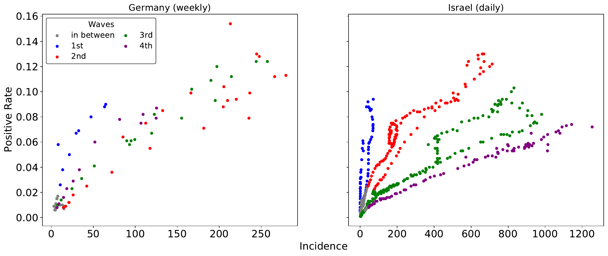

During the Covid pandemic, political interventions in Germany were routinely
discussed in the light of one number: the incidence statistic. Contact
restrictions were tied to it directly, with the same thresholds everywhere.
Look closely and that number carries several biases, and stops reflecting the
pandemic situation it was standing in for.

This post takes three of them at a very superficial level. More rigorous
descriptions are in the report referenced at the foot of this page, written
during a module at the University of Tübingen in 2021.

One thing worth saying up front, because it decides what "better" even means
here: the reason to restrict contacts was to keep hospitals functioning. So
the fair test of the incidence number is not whether it counts cases
correctly, but whether it predicts **intensive care occupancy**. Every bias
below is a way it fails that test.

## It counts tests, not infections

Incidence is positive tests per 100,000 people over seven days. Test more
people and you find more cases, with nothing about the pandemic having
changed. What actually indicates risk is the *share* of tests coming back
positive.

Germany's second wave shows the gap plainly. One week carried an incidence of
205 with 8.5% of tests positive. Another week carried a slightly higher 210 —
with roughly 16% positive. The headline number is the same; the fraction of
tested people who turned out to be infected is double.

*Positive rate against incidence, by wave. Left: Germany, one point per week.
Right: Israel, one point per day — there each wave sits on its own line, and
the lines get flatter as the country tests more.*

Israel, on the right, shows the mechanism cleanly, because the waves separate
into distinct lines. They get flatter from wave to wave: the same incidence
arrives with a lower and lower positive rate. That is testing volume rising —
at peak incidence Israel ran 1.5 tests per 1,000 people in the first wave,
5.8 in the second, 12.8 in the third and 19 in the fourth. Read the other
way, the first wave is the steep blue line, and steep is bad: a high positive
rate off very few detected cases means far more infections went unseen then
than in any later wave. The incidence understated the pandemic most exactly
when it was newest.

The correction is cheap, because the positive rate is already collected — and
it can be more than a correction. Hold the positive rate down and you are
testing widely enough to catch outbreaks while they are small, which makes it
a target for testing policy rather than only a reading of it. Denmark is the
illustration: the only European country through just two waves by late 2021,
and the only one holding a mostly constant positive rate below 2%.

## The same number means different things depending on how full the ICUs are

An incidence of 400 is not one situation. It depends entirely on how much
headroom the hospitals have when it arrives.

Italy's second wave peaked near an incidence of 600; its third peaked below
400. Yet ICU patients per million peaked at roughly the same level — about 60
— in both. The reason is what the third wave started from: half the ICU beds
were still occupied in March 2021, before it began.

*Italy. The blue incidence curve peaks far higher in the second wave than the
third; the orange ICU curve reaches almost the same height in both.*

This one is not a testing artefact, and the numbers rule that out directly.
At peak incidence, Italy ran 6.1 tests per positive case in the second wave
and 14 in the third. They were testing *more*, not less.

It also argues against a single national threshold. German contact rules were
set per district, but ICU capacity is not distributed evenly — Saarland has
roughly 50 intensive care beds per 100,000 inhabitants, Brandenburg about 25.
The same incidence in both places describes two different degrees of trouble.

## Vaccination breaks the link — and then partly restores it

Once a population starts getting vaccinated, incidence and ICU demand come
apart: the same number of cases sends fewer people to intensive care. In
Denmark, cumulative ICU occupancy flattens after vaccination begins while
cumulative incidence keeps climbing at much the same rate.

*Cumulative ICU occupancy against cumulative incidence. Dotted lines mark
vaccination milestones. Watch Israel on the right: the curves separate, then
close again.*

The part that complicates it is that the effect decays. Israel vaccinated
earliest, and by its fourth wave the two curves were rising in step again —
while in the UK, which reached the same coverage months later, the gap was
still open. Adjusting for vaccination therefore takes two variables, not one:
how much of the population is covered, and how long ago they were covered.

## What it adds up to

None of this makes incidence a bad number. It is a fast, cheap, real-time
estimate of how many infections have been detected, and there is nothing else
quite like it for that.

It is simply not, on its own, a measure of how much trouble the hospitals are
in — which is what the decisions attached to it were actually about. Read
alongside the positive rate, current ICU occupancy and the vaccination state
of the population, it becomes considerably more expressive. Read alone, and
tied to a fixed nationwide threshold, it quietly means something different in
every district and in every wave.
